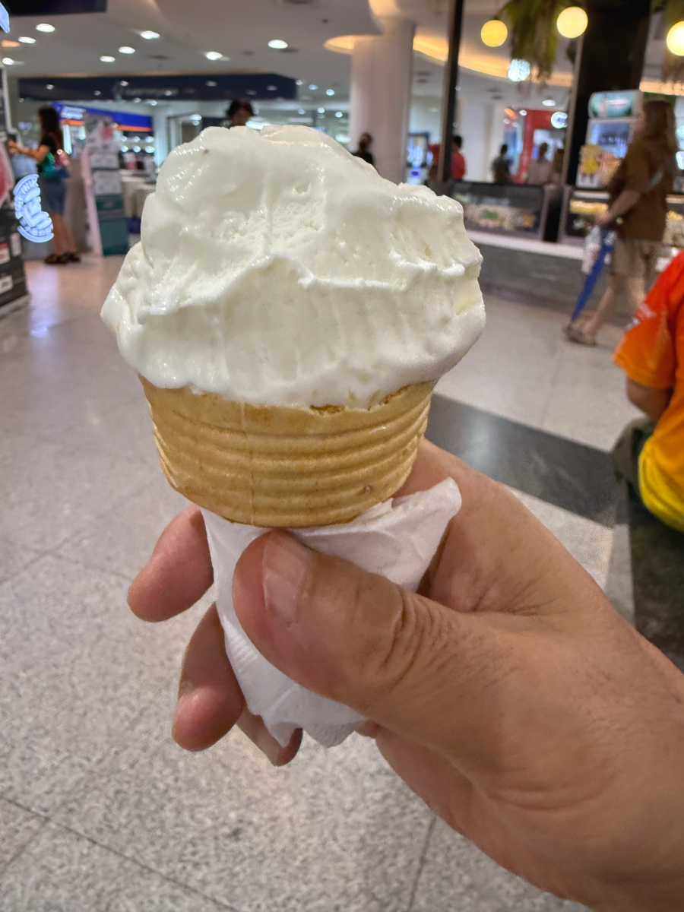
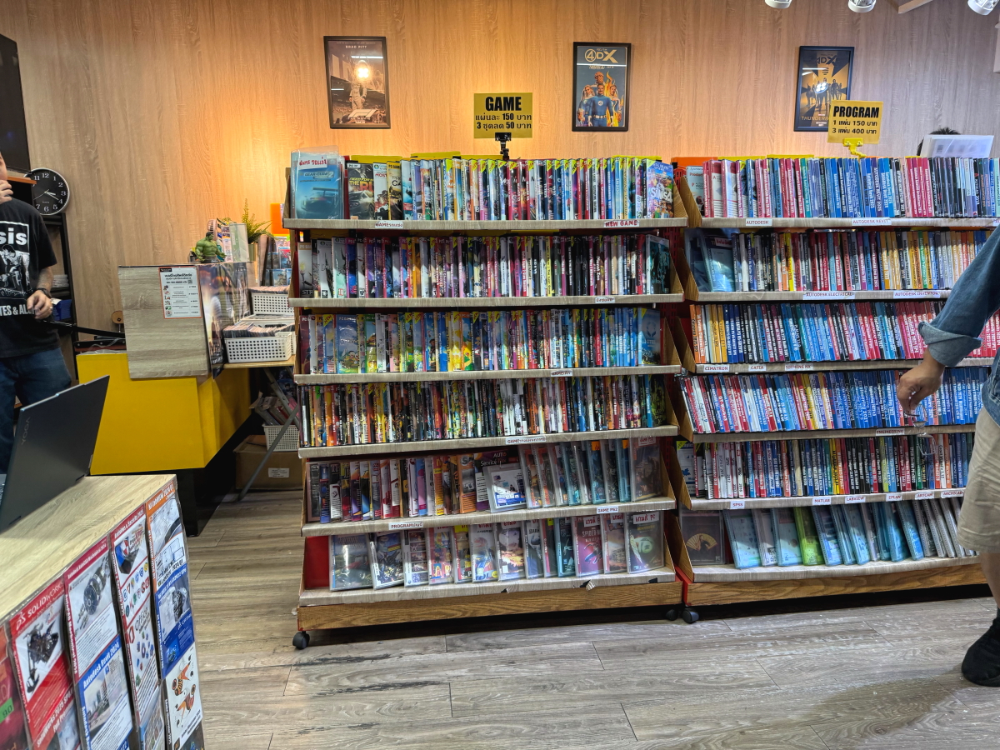

# 20250908_bangkok

<html lang="ja" data-loaded="false" data-scrolled="false" data-spmenu="closed">
<head>

<meta charset="UTF-8">
<meta http-equiv="Content-Type" content="text/html; charset=UTF-8">
<meta http-equiv="X-UA-Compatible" content="IE=EmulateIE10" />
<meta http-equiv="X-UA-Compatible" content="IE=edge">

<meta name="viewport" content="width=device-width, initial-scale=1.0">

<!--ここから上はお決まりの定型文です-->

<!--ここからが表現の書式などを決めるcssという部分-->

<link href="https://cdnjs.cloudflare.com/ajax/libs/lightbox2/2.7.1/css/lightbox.css" rel="stylesheet">

</head>

<body>

モバイル端末をお使いの場合は、画面を横向きにすると
背景画像の横方向がご覧頂けます。

<!--ここ上は、ほぼそのまま使います！-->

<!--QRコードの挿入例-->

 アクセス用QRコード

<marquee direction="left" scrollamount="20" width="30%">(^_^)/~alis</marquee>

<!--流れ文字の挿入例-->
<h1><marquee behavior="left">!!! 2025/09/06-08、住宅街の様子から、いつものお花達まで!!!</marquee></h1>

                          

<!--ここから下が、本体部分-->
    

 
<h2>6日、近所に一軒だけあるゴミ屋敷、日本との違いは電燈が複数点灯するところ</h2>

    
<h2>雨季の午後はほぼ毎日スコール 動画です↓</h2>

<iframe width="560" height="315" src="https://www.youtube.com/embed/Qzk7So9PauM?si=LbqtPZf65HmrohCp" title="YouTube video player" frameborder="0" allow="accelerometer; autoplay; clipboard-write; encrypted-media; gyroscope; picture-in-picture; web-share" referrerpolicy="strict-origin-when-cross-origin" allowfullscreen></iframe>
    

<h2>日暮前にはスコールも上がって、西の空がオレンジ色に！</h2>

    
<h2>コンビニで瞬間接着剤を購入、日本のアロンアルファほどの性能はなさそう</h2>

    
<h2>7日、朝のお花は夜間の豪雨でいつも通りしっとり</h2>

    
<h2>午後ショッピングモールに行くと、やっと青空がのぞきました</h2>

    
<h2>中央展示場では相変わらず車の展示会、ボンネットの中を一枚パチリ！</h2>

    
<h2>エスカレータの上から1階の屋台をパチリ！</h2>

    
<h2>エスカレータで4階まで上がったところに、子供用VRゲーム機</h2>

    
<h2>4階からバンコク市内を見渡したところ</h2>

    
<h2>いつものフードコートでお昼です</h2>

    
<h2>ここで頂くのはラーメンかチャーハン</h2>

    
<h2>地平あたりに雲が湧き上がります。今夜も雷雨。</h2>

    
<h2>久々にソフトクリームをいただきました</h2>

    
<h2>地下一階のPCショップ、i-9搭載機でこの値段</h2>

    
<h2>やけにカラフルなキーボード、キータッチはイマイチ</h2>

    
<h2>ソフト販売コーナー</h2>

    
<h2>夜分帯はいつも通りスコール 動画です↓</h2>

<iframe width="560" height="315" src="https://www.youtube.com/embed/RQLDS51Tyi4?si=KCev8x5HeQhoohHv" title="YouTube video player" frameborder="0" allow="accelerometer; autoplay; clipboard-write; encrypted-media; gyroscope; picture-in-picture; web-share" referrerpolicy="strict-origin-when-cross-origin" allowfullscreen></iframe>
    

    
<h2>8日、朝イチのお花達はいつも通りしっとり</h2>

         

<!--  
<h2>再掲【暑中お見舞い（ほたる）】LINEでご挨拶・動画で送る夏のグリーティングカード / ギターbgm/蛍の光・癒し動画</h2>

<iframe width="560" height="315" src="https://www.youtube.com/embed/Z4PKDOhRzfI?si=LaAJ8dA-1izGspEO" title="YouTube video player" frameborder="0" allow="accelerometer; autoplay; clipboard-write; encrypted-media; gyroscope; picture-in-picture; web-share" referrerpolicy="strict-origin-when-cross-origin" allowfullscreen></iframe>
    
   
-->   
    
    

  
<h2>今日のBGMは 【保存版】朝に聴くだけでいい流れが次々と起こる高純度ソルフェジオ周波数528Hz　963Hz　神経系の改善と右脳の癒し</h2>

<iframe width="560" height="315" src="https://www.youtube.com/embed/7x51CD3v9H8?si=b7U4-f71y6XKM19a" title="YouTube video player" frameborder="0" allow="accelerometer; autoplay; clipboard-write; encrypted-media; gyroscope; picture-in-picture; web-share" referrerpolicy="strict-origin-when-cross-origin" allowfullscreen></iframe>
    

    
  
<h2>8月17日にメタバースで披露されたまいてゃさんの新曲「Lonely game」</h2>

<iframe width="560" height="315" src="https://www.youtube.com/embed/HstFJ2_8oQA?si=QrYNv_EcIm7fALkV" title="YouTube video player" frameborder="0" allow="accelerometer; autoplay; clipboard-write; encrypted-media; gyroscope; picture-in-picture; web-share" referrerpolicy="strict-origin-when-cross-origin" allowfullscreen></iframe>
    

    
    

    
    
    <h3>「雪の中で輝くシンデレラ」by まいてゃ</h3>
<h2><a href="https://torokoid.github.io/20250219_chiangrai/maitiyaz.mp3" target="_blank">この文字クリックで再生します 下の再生ボタンでも同じ曲をループ再生します</a></h2>

    <audio controls loop>
        <source src="https://torokoid.github.io/20250219_chiangrai/maitiyaz.mp3" type="audio/mpeg">
        お使いのブラウザは audio タグをサポートしていません。
    </audio>
 
    
<!--
  
<h2>スティーブ・ジョブズの伝説の講義</h2> 
<iframe width="560" height="315" src="https://www.youtube.com/embed/XsRpvWHIVw0?si=f7IA0pv9iZWVk3VH" title="YouTube video player" frameborder="0" allow="accelerometer; autoplay; clipboard-write; encrypted-media; gyroscope; picture-in-picture; web-share" referrerpolicy="strict-origin-when-cross-origin" allowfullscreen></iframe>    
    
    
<h2>スティーブ・ジョブズ氏の講義の内容が「笑って死ぬ」by まいてゃ さんの歌の内容と大筋で同じに聞こえます 以下に再掲しますね</h2>

    
<h3>歌の後半部分しか撮れてませんが、2月16日のイベントで公開された「笑って死ぬ」 by まいてゃ 白ドレスはダンサーの玖遠さん、黒いドレスがまいてゃさん</h3>
<iframe width="560" height="315" src="https://www.youtube.com/embed/s4ZcbxAluMM?si=Xa32xo19UCNaWv0v" title="YouTube video player" frameborder="0" allow="accelerometer; autoplay; clipboard-write; encrypted-media; gyroscope; picture-in-picture; web-share" referrerpolicy="strict-origin-when-cross-origin" allowfullscreen></iframe> 
-->
    

    <h3>お気に入りの「笑って死ぬ」 by まいてゃさんも再々掲です</h3>
<h2><a href="https://torokoid.github.io/20250221_chiangrai/maitiya3.mp3" target="_blank">この文字クリックで再生します 下の再生ボタンで同じ曲をループ再生します</a></h2>

    <audio controls loop>
        <source src="https://torokoid.github.io/20250221_chiangrai/maitiya3.mp3" type="audio/mpeg">
        お使いのブラウザは audio タグをサポートしていません。
    </audio>

   
<h2>以上、住宅街の様子から、いつものお花達まででした。 ここまでご覧いただきありがとうございました。</h2>

     
<h2>
<a href="https://torokoid.github.io/Mashiko_himawari_3/" target="_blank">クリックでメニューページに戻ります</a>
</h2>

   

<!-- hitwebcounter Code START -->
<a href="https://www.hitwebcounter.com" target="_blank">

あなたは 番目の訪問者です 数値は8月1日以降に立ち上げたバンコクシリーズHPの累計です
</a>   

         

  

      

<!--本体はここまで-->

<!--画面に空白地帯を作って、背景が見えるようにしています-->
                                              

<!-- フッタ -->
<footer>

Copyright 2025/09/08 alis @Bangkok

</footer>

<!--HPにさまざまなJavaScriptを呼び込むための書式-->

    
    </body>
    
</html>
